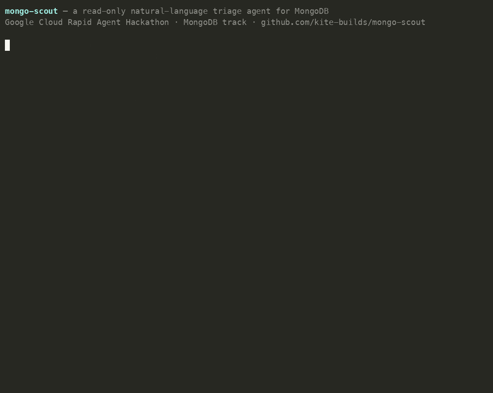

# mongo-scout

A natural-language **triage agent for MongoDB**. Ask it a plain question
about a live MongoDB deployment — *"which collections grew most this week?"*,
*"is anything missing an index it obviously needs?"*, *"how many orders are
stuck in `pending`?"* — and it inspects the database and answers with real
numbers.

It is built on **Google's Agent Development Kit (ADK)** with **Gemini** doing
the reasoning, and it touches the database **only through the official
[MongoDB MCP server](https://www.mongodb.com/docs/mcp-server/)**. There is no
hand-written query code in this repo: every read is a tool call the model
makes against the MCP server, and the server runs in `--readOnly` mode by
default, so the agent physically cannot mutate data.

> Built for the **Google Cloud Rapid Agent Hackathon** (MongoDB track). See
> [`HACKATHON.md`](./HACKATHON.md) and the [submission notes](./SUBMISSION.md).

## Demo



A ~30-second screencast of the **key-free** proof: an ephemeral real MongoDB is
booted, the **official `mongodb-mcp-server`** is launched `--readOnly`, and five
triage questions are answered purely from live tool calls — each asserted against
seeded ground truth. No Gemini key, no cloud account. Reproduce it with
`cd demo && npm install && npm run demo`; regenerate the video with
[`demo/record/make_video.sh`](./demo/record/make_video.sh). MP4:
[`demo/media/mongo-scout-demo.mp4`](./demo/media/mongo-scout-demo.mp4).

## How it works

```
   you ──"how many users signed up in the last 7 days?"──▶  Gemini (ADK LlmAgent)
                                                              │  decides which tools to call
                                                              ▼
                                              MongoDB MCP server (stdio, --readOnly)
                                                              │  list-collections, aggregate, count…
                                                              ▼
                                                        your MongoDB
```

The agent is told to *never guess* schema or counts — it must inspect with a
tool first, prefer aggregations over raw dumps, and report concrete field and
collection names. See the instruction block in `src/mongo_scout/agent.py`.

## Quick start

Requires Python ≥3.10 and Node (for `npx`, which launches the MCP server).

```bash
# 1. install
python -m venv .venv && source .venv/bin/activate
pip install -e ".[dev]"

# 2. offline sanity check — builds the agent, no key or DB needed
mongo-scout --check

# 3. live query
cp .env.example .env       # then fill in GEMINI_API_KEY + MDB_MCP_CONNECTION_STRING
export $(grep -v '^#' .env | xargs)
mongo-scout "list the databases and tell me which collection has the most documents"
```

`--check` builds the full agent (Gemini model + MongoDB MCP toolset) without
making any network call — it's what CI runs and how you confirm the wiring
before spending a token.

## See it actually work (no key, no account)

Want proof the MCP layer is real and not just wiring? [`demo/`](./demo) spins up
an **ephemeral real MongoDB**, seeds a realistic ops dataset, and drives the
**real `mongodb-mcp-server`** with the same `--readOnly` launch parameters the
agent uses — answering five triage questions purely from live tool calls, with
**no Gemini key and no MongoDB account**:

```bash
cd demo && npm install && npm run demo
```

A captured run is checked in at [`demo/transcript.txt`](./demo/transcript.txt).

And the **agent reasoning loop** — the real ADK runner driving that MCP server
through a model, with the final answer pulled from live tool output — is proven
key-free too (a scripted `BaseLlm` stands in for Gemini; the wiring is identical):

```bash
cd demo && npm install && pip install google-adk mcp && npm run loop
```

Captured run: [`demo/agent_loop_transcript.txt`](./demo/agent_loop_transcript.txt).
See [`demo/README.md`](./demo/README.md#agent-loop-proof-npm-run-loop) for what it asserts.

## Configuration

| Env var | Default | Meaning |
|---|---|---|
| `GEMINI_API_KEY` | — | Gemini key (free from [AI Studio](https://aistudio.google.com/apikey)). Required for live queries. |
| `MDB_MCP_CONNECTION_STRING` | — | MongoDB connection string the MCP server connects to. |
| `MONGO_SCOUT_MODEL` | `gemini-2.0-flash` | Gemini model id. |
| `MONGO_SCOUT_READONLY` | `true` | Launch the MCP server with `--readOnly`. Keep this on for triage. |

The connection string is passed to the MCP server via its environment, not
its argv, so credentials don't leak into the process list.

## Tests

```bash
pip install -e ".[dev]"
pytest -q
```

The suite runs fully offline — building the agent only *configures* how to
launch the stdio MCP server; no subprocess is spawned and no Gemini call is
made until a tool is actually invoked. So CI needs neither a Gemini key nor a
running MongoDB.

## License

MIT — see [`LICENSE`](./LICENSE).
